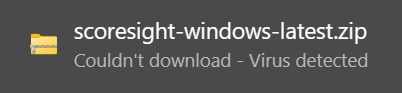
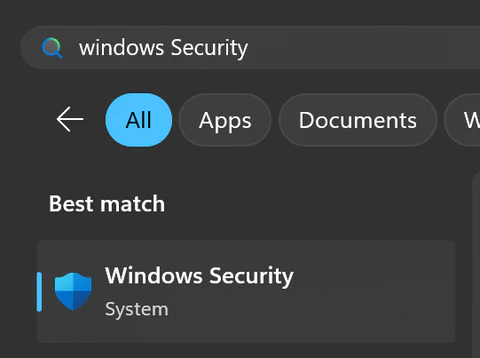
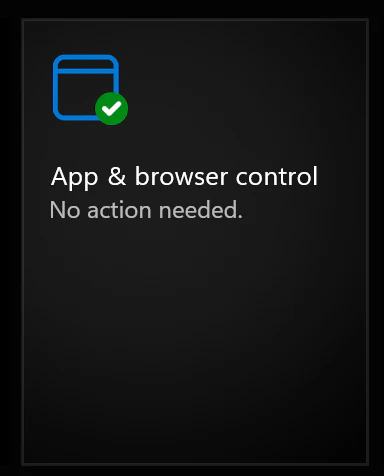
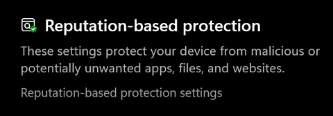
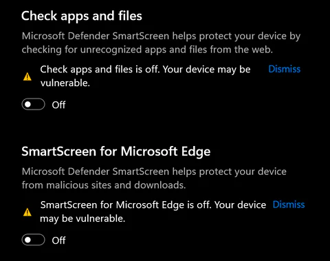
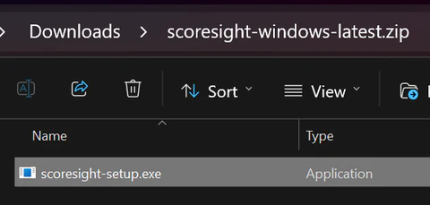
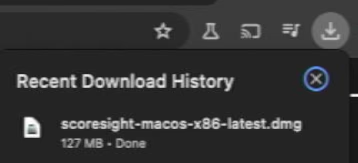
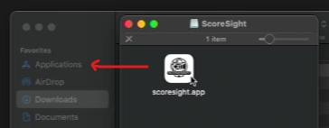

# How to Download and Install ScoreSight

Downloading ScoreSight for your operating system is a simple process. Visit the [releases](https://github.com/occ-ai/scoresight/releases) to find the download links.

## Windows

If your browser alerts you for a virus warning when downloading ScoreSight like so:

This is a false alarm issue by Microsoft and Google. To bypass this alarm and download the file you may need to temporarily disable the Windows Defender that issues the alarm and prevents the file download. This is simple to do, and you can undo it right after downloading ScoreSight to resume protection of your PC.

Open Windows Security by pressing the Windows Key and enter "Windows Security"

Click "App and Browser Control"

Click "Reputation Based protection"

And disable the "Check Apps and Files" and "SmartScreen for Microsoft Edge" options.

Then download ScoreSight again. This time the download should go through and the file will be available on your PC. Re-enable the two options above to resume protecting your computer from malicious software.

If you are having problems with the download still please reach out on support@scoresight.live

To install on Windows, simply click the .zip file and then the .exe setup installer inside.

Once the setup is complete, ScoreSight will be available as an application.

## Mac OS

On Mac OS ScoreSight comes as packaged .app application which doesn't need installation.

Download the .dmg archive:

Double click and optionally drag the scoresight.app file to your Applications folder:

ScoreSight should now be available as an application.
