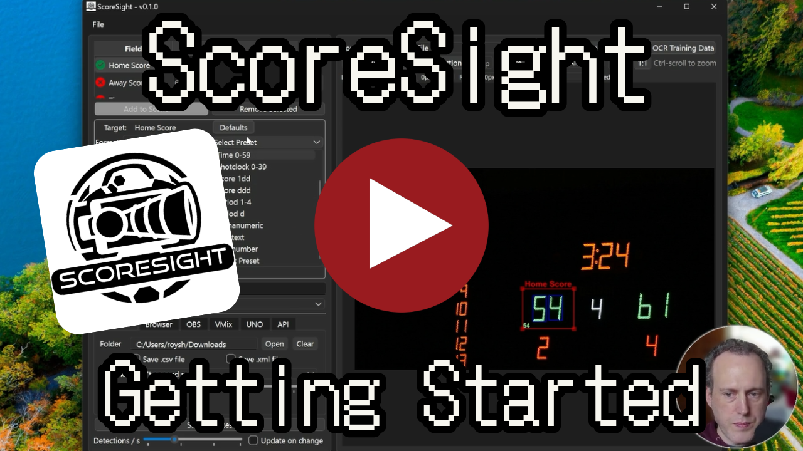
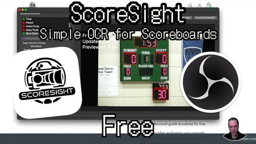
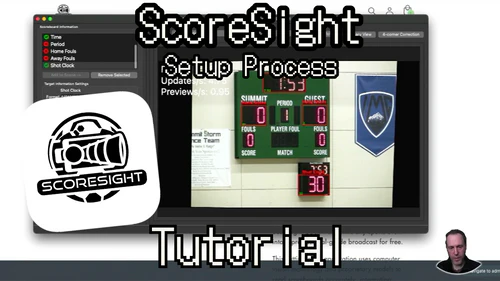
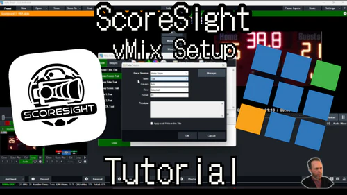
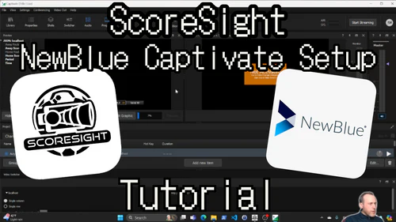
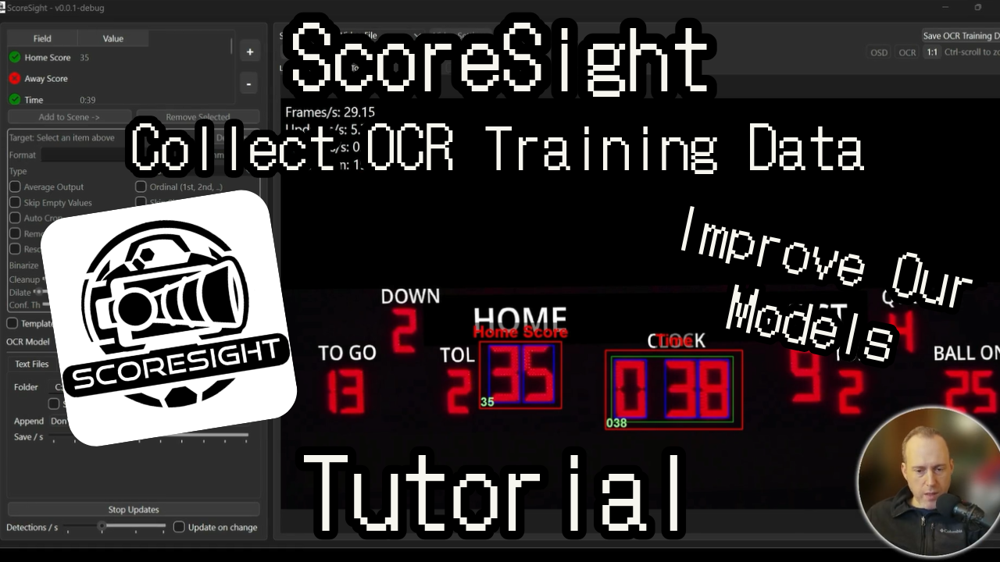

# ⚠️ Stalled ⚠️ This project is not under active development

## ScoreSight - Real-time OCR For Scoreboards, Apps, Games and more

<div align="center">

[](https://github.com/occ-ai/scoresight/blob/main/LICENSE)
[](https://github.com/occ-ai/scoresight/actions/workflows/build.yaml)
[](https://github.com/occ-ai/scoresight/releases)
[](https://github.com/occ-ai/scoresight/releases)

</div>

ScoreSight is an OCR (Optical Character Recognition) application designed to extract text from real-time updating streams like scoreboards, applications, videos and games.

<div align="center">
<a href="https://youtu.be/MtctQZ2DIjU" target="_blank"></a>
</div>

It is written in Python and utilizes the following technologies:

- Qt6: A cross-platform GUI toolkit for creating graphical user interfaces.
- OpenCV: A computer vision library for image and video processing.
- Tesseract OCR: An open-source OCR engine for recognizing text from images.

It is the best **free** real-time OCR tool on planet Earth for scoreboards and games.

## Features

- Works natively on Windows, Mac and Linux (the only scoreboard OCR tool that does it)
- Input/Capture: USB, NDI, Screen Capture, URL / RTSP, Video Files, etc.
- Perspective correction
- Image processing and binarization techniques, local, global etc.
- Output to text files (.txt, .csv, .xml)
- [HTTP output via local server](docs/http_server.md): HTML, JSON, XML and CSV endpoints
- Call external HTTP services with the OCR data
- Import & Export configuration profiles
- Integrations: [OBS](https://obsproject.com/) (websocket), [vMix](docs/vmix.md) (API), [NewBlue FX Titler](https://newbluefx.com/titler-live) (API), [UNO](https://www.overlays.uno/) (API), [generic HTTP APIs](docs/out_api.md)
- Up to 30 updates/s
- Unlimited detection boxes
- Camera bump and drift correction with stabilization algorithm
- Unlimited devices or open instances on the same device
- Detect any scoreboard fonts, general fonts and even "dot" indicators
- Translated to 12 languages (English, German, Spanish, French, Italian, Japanese, Korean, Dutch, Polish, Portugese, Russian, Chinese)
- [Collect OCR training data](docs/data_annotation.md) and annotate it with a built-in tool

Price: FREE.

## Usage

Very short video tutorials:

<div>
<a href="https://youtu.be/wMNolI0w0tE" target="_blank"></a>
<a href="https://youtu.be/ACY4-yT3x84" target="_blank"></a>
<a href="https://youtu.be/yowoYzBWrps" target="_blank"></a>
<a href="https://youtu.be/ptR-Yh5FSPg" target="_blank"></a>
<a href="https://youtu.be/QO76EFmJ7Ig" target="_blank"></a>
</div>

Additional guides:

- [How to use the internal HTTP server](docs/http_server.md)
- [How to connect to vMix](docs/vmix.md)
- [How to send API requests to external services](docs/out_api.md)
- [How to collect and annotate OCR training data](docs/data_annotation.md)

## Installation

See the [releases](https://github.com/occ-ai/scoresight/releases) page for downloadable executables and installers.

See the [Install Guide](docs/INSTALL.md) for help with installation.

## Running and Building from Source

### Prerequisites

- Python 3.11
- git

### Procedure

1. Clone the repository:

  ```shell
  git clone https://github.com/occ-ai/scoresight.git
  ```

2. Install the required dependencies:

  ```shell
  pip install -r requirements.txt
  ```

For Mac and Windows there are further dependencies in `requirements-mac.txt` and `requirements-win.txt`

3. Create a `.env` file. See the contents of the file in the `.github/worksflows/build.yaml` file

### Windows

There are some extra steps for installation on Windows:
 - Download and install https://visualstudio.microsoft.com/visual-cpp-build-tools/ C++ Build Tools
 - Build the win32DeviceEnum pyd by `$ cd src/win32DeviceEnum && python.exe setup.py build_ext --inplace`

#### MacOS

On Mac, and particularly on Arm64, you will need to install dependencies manually.
This is reflected in the ./github/actions/build.yaml file.

1. [cyndilib](https://github.com/nocarryr/cyndilib)

Get the project from the repo and build it locally
```
$ git clone https://github.com/nocarryr/cyndilib.git
$ cd cyndilib
$ pip install setuptools numpy cython
$ pip install .
```

2. [tesserocr](https://github.com/sirfz/tesserocr)

Get the project from the repo and built it locally.
This assumes you have Homewbrew in `/opt/homebrew` but if it's in `/usr/local` then there's no need for the extra flagging.

```
$ git clone https://github.com/sirfz/tesserocr.git
$ cd tesserocr
$ /opt/homebrew/brew install tesseract leptonica
$ PATH="$PATH:/opt/homebrew/bin" CPPFLAGS="-I/opt/homebrew/include -L/opt/homebrew/lib" python3 -m pip install --no-binary tesserocr tesserocr
```

### Running from source

1. Compile the UI files into Python:

    ```powershell
    ./scripts/compile_ui.ps1
    ```

1. Launch the application:

    ```shell
    python main.py
    ```

1. Follow the on-screen instructions to load an image of the scoreboard and extract the text.

### Build an executable

You may want to build a distributable .exe or .app or even an installer, this is possible with [PyInstaller](https://github.com/pyinstaller/pyinstaller).

To build the executable run PyInstaller.

#### MacOS

```
pyinstaller --clean --noconfirm scoresight.spec -- --mac_osx
```

#### Windows

```
pyinstaller --clean --noconfirm scoresight.spec -- --win
```

#### Linux

```
pyinstaller --clean --noconfirm scoresight.spec
```


## Contributing

Contributions are welcome! If you would like to contribute to this project, please follow these steps:

1. Fork the repository.
2. Create a new branch for your feature or bug fix.
3. Make your changes and commit them.
4. Push your changes to your forked repository.
5. Submit a pull request.

## License

This project is released under the MIT license.
