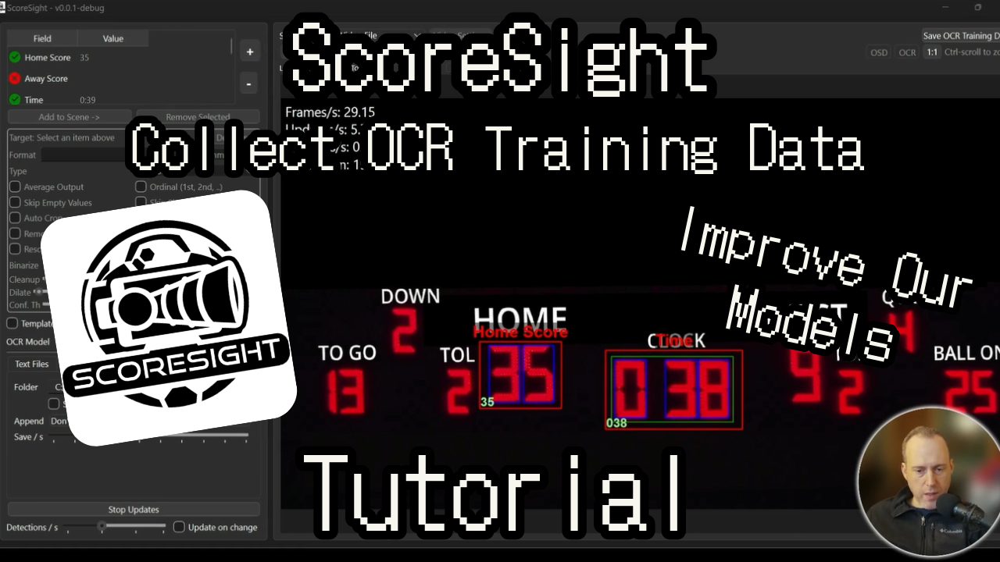

# ScoreSight - Real-time OCR For Scoreboards, Apps, Games and more

ScoreSight is an OCR (Optical Character Recognition) application designed to extract text from real-time updating streams like scoreboards, applications, videos and games. It is the best **free** real-time OCR tool on planet Earth for scoreboards and games.

<strong>Download</strong>

If you'd like to donate to help support the project, you can do so on [GitHub](https://github.com/sponsors/royshil) or [Patreon](https://www.patreon.com/RoyShilkrot) or [OpenCollective](https://opencollective.com/occ-ai).

## Features

- Works on Windows, Mac and Linux (the only scoreboard OCR tool that does it)
- Input/Capture: USB, NDI, Screen Capture, URL / RTSP, Video Files, etc.
- Perspective correction
- Image processing and binarization techniques, local, global etc.
- Output to text files (.txt, .csv, .xml)
- [HTTP output via local server](http_server.md): HTML, JSON, XML and CSV endpoints
- Call external HTTP services with the OCR data
- Import & Export configuration profiles
- Integrations: [OBS](https://obsproject.com/) (websocket), [vMix](vmix.md) (API), [NewBlue FX Titler](https://newbluefx.com/titler-live) (API), [UNO](https://www.overlays.uno/) (API), generic HTTP APIs
- Up to 30 updates/s
- Unlimited detection boxes
- Template fields: Derived from other fields and optional extra text
- Camera bump and drift correction with stabilization algorithm
- Unlimited devices or open instances on the same device
- Detect any scoreboard fonts, general fonts and even "dot" indicators
- Translated to 12 languages (English, German, Spanish, French, Italian, Japanese, Korean, Dutch, Polish, Portugese, Russian, Chinese)
- Collect OCR training data and annotate it with a built-in tool

Price: FREE.

## Usage

Very short video tutorials:

Additional guides:

- [How to use the internal HTTP server](http_server.md)
- [How to connect to vMix](vmix.md)
- [How to send API requests to external services](out_api.md)
- [How to collect and annotate OCR training data](data_annotation.md)

## Installation

See the [releases](https://github.com/locaal-ai/scoresight/releases) page for downloadable executables and installers.

See the [Install Guide](INSTALL.md) for help with installation.

## License

This project is released under the MIT license.

## Contact

If you have any questions or suggestions, feel free to leave an issue on the repository.
You may also email [support@scoresight.live](mailto:support@scoresight.live).

For live support reach out on [Discord](https://discord.gg/8pG2tC923N).

## Business Inquiries

If you wish to contract the development team to productionize ScoreSight for your needs,
please contact [info@scoresight.live](mailto:info@scoresight.live).
