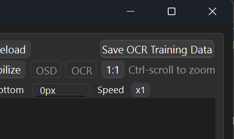
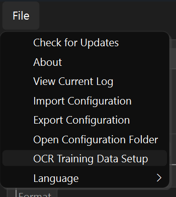
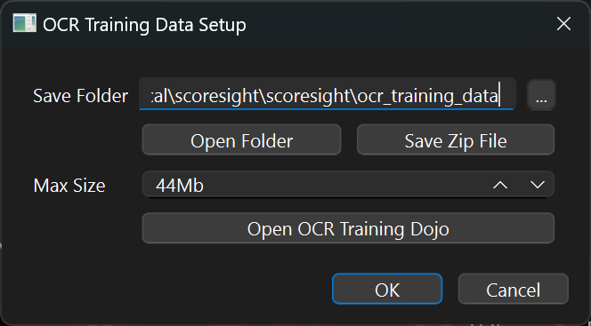
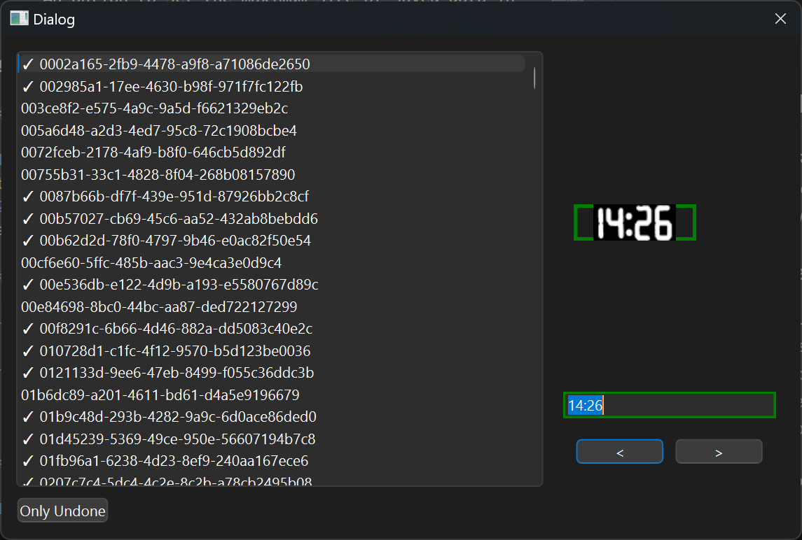
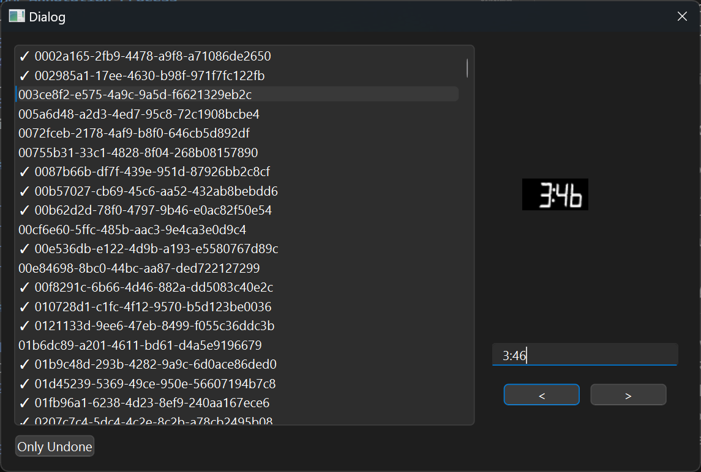

# OCR Training Data Collection and Annotation Tutorial

This guide will walk you through the process of collecting and annotating OCR training data using the "Training Dojo" tool.

## Collecting OCR Training Data

1. To start collecting OCR training data, click the button in the top right corner of the main interface.
2. The system will begin capturing data for OCR training.

## Managing OCR Training Data

1. Once you've collected some data, go to the File menu.
2. Click on "OCR Training Data Settings" to access data management options.

3. In the settings window, you'll find:
   - The folder where data is stored
   - A button to open this folder directly
   - A button to save the collected data as a ZIP file
   - An option to set the maximum size of saved data in MB

## Using the Training Dojo Tool

1. In the OCR Training Data Settings, click the button to open the Training Dojo tool.
2. The tool will display all collected files for annotation.

### Interface Overview

- Left side: List of all files
  - Files with approved annotations have a checkmark
- Right side: Current image and annotation interface
  - Line edit field for entering or approving annotations
  - Approved annotations are highlighted in green

### Annotation Process

1. For each image, enter the correct text in the line edit field.

2. Press Enter to approve the annotation and move to the next image.
3. Use Up/Down arrow keys to navigate through the list.
4. Use Ctrl+Down and Ctrl+Up to jump to the next unapproved image.
5. Click the filter button to show only unapproved images.

### Keyboard Shortcuts

- Enter: Approve annotation and move to next image
- Up/Down Arrows: Navigate through the list
- Ctrl+Down: Jump to next unapproved image
- Ctrl+Up: Jump to previous unapproved image

## Exporting Annotated Data

1. Once you've finished annotating, exit the Training Dojo tool.
2. In the OCR Training Data Settings:
   - Click the button to save data as a ZIP file
   - Choose a location to save the file
3. Send the exported ZIP file to our team at [support@scoresight.live](mailto:support@scoresight.live) for processing. We will be in touch with a new OCR model.

## Best Practices

1. Annotate regularly to maintain a manageable workload.
2. Use keyboard shortcuts for faster navigation and annotation.
3. Double-check your annotations before approving.
4. Use the filter option to focus on unapproved images when nearing completion.
5. Set a reasonable max size for saved data to prevent overwhelming file sizes.

By following this process, you'll contribute valuable training data to improve the OCR system's accuracy and performance. Thank you for your efforts in enhancing our OCR capabilities!