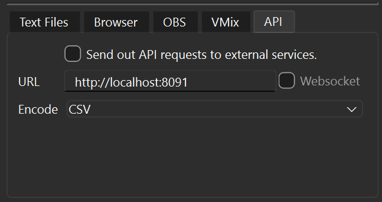
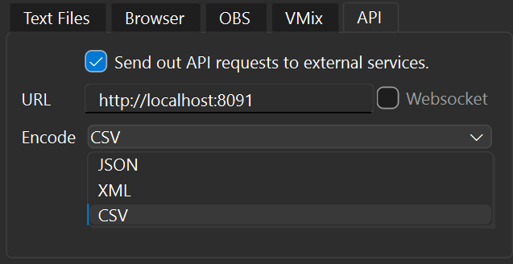

# ScoreSight Outboud API Integration Tutorial

ScoreSight now offers the ability to send OCR-extracted scoreboard data to external APIs. This tutorial will guide you through setting up the feature and provide a simple Python script to receive the data.

## Enabling API Requests in ScoreSight

1. Open ScoreSight and navigate to the "API" tab in the bottom left corner.



2. Check the box labeled "Send out API requests to external services".
3. Enter the URL where you want to send the data in the provided box.
4. Select the encoding format for the data: JSON, XML, or CSV.



## Troubleshooting

If you encounter issues with the API integration, follow these steps to troubleshoot:

1. Check ScoreSight Logs:
   - Open ScoreSight and navigate to the "Logs" section.
   - Look for any error messages related to HTTP requests or API communication.
   - Common errors might include "Connection refused", "Timeout", or "Invalid URL".
   - For example if the URL is incorrect you may see the following message:
   ```
   nnnn-nn-nn 10:59:14,743 - ERROR - api_output - Error sending data to output API: http://localahost:8091, HTTPConnectionPool(host='localahost', port=8091): Max retries exceeded with url: / (Caused by NameResolutionError("<urllib3.connection.HTTPConnection object at 0x0000019089C20DA0>: Failed to resolve 'localahost' ([Errno 11001] getaddrinfo failed)"))
   ```

2. Verify the URL:
   - Double-check the URL you've entered in the API settings.
   - Ensure it's correctly formatted (e.g., `http://localhost:8091` for local testing).
   - If using an external API, verify that the URL is correct and the service is running.

3. Encoding Format:
   - Verify that the encoding format selected in ScoreSight (JSON, XML, or CSV) matches the format your receiving script or API expects.

4. Server Availability and Authentication:
   - If using the provided Python script, make sure it's running before attempting to send data from ScoreSight.
   - For external APIs, check if the service is up and accessible.
   - If your external API requires an API key or authentication, ensure these details are correctly included in the URL or headers.
   - If testing locally, check that your firewall isn't blocking the connection.

5. Test with a Simple Server:
   - Use the provided Python script below as a test server to isolate whether the issue is with ScoreSight or the receiving end.

If problems persist after trying these steps, consider reaching out to ScoreSight support for further assistance.

## Receiving Data with a Python Script

Here's a simple Python script that sets up a local server to receive HTTP requests from ScoreSight:

```python
from http.server import HTTPServer, BaseHTTPRequestHandler
import json

class RequestHandler(BaseHTTPRequestHandler):
    def do_POST(self):
        content_length = int(self.headers['Content-Length'])
        post_data = self.rfile.read(content_length)
        
        print("Received data:")
        try:
            # Assuming JSON format, adjust if using XML or CSV
            data = json.loads(post_data.decode('utf-8'))
            print(json.dumps(data, indent=2))
        except json.JSONDecodeError:
            print(post_data.decode('utf-8'))
        
        self.send_response(200)
        self.end_headers()
        self.wfile.write(b'OK')

def run_server(port=8091):
    server_address = ('', port)
    httpd = HTTPServer(server_address, RequestHandler)
    print(f"Server running on port {port}")
    httpd.serve_forever()

if __name__ == '__main__':
    run_server()
```

To run the script:

1. Save the script as `scoresight_receiver.py`
2. Open a terminal or command prompt
3. Navigate to the directory containing the script
4. Run the following command:

```
python scoresight_receiver.py
```

The server will start and listen for incoming requests on `http://localhost:8091`. Make sure to use this URL in ScoreSight's API settings.

When ScoreSight sends data, the script will print it to the console. You can modify the script to process or store the data as needed.

You may see in the console an output similar to:

```
127.0.0.1 - - [nn/nn/nnnn 10:57:03] "POST / HTTP/1.1" 200 -
Received data: Name,Text,State,X,Y,Width,Height
Time,0:52,SameNoChange,843.656319861826,663.0215827338131,359.13669064748206,207.19424460431662
Home Score,35,SameNoChange,525.969716884406,638.4370727628325,214.62426933453253,175.27648662320166
```

Remember to adjust the script if you're using XML or CSV encoding instead of JSON.

Check the console where it's running for any error messages or unexpected output.