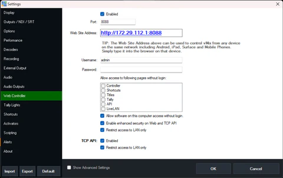
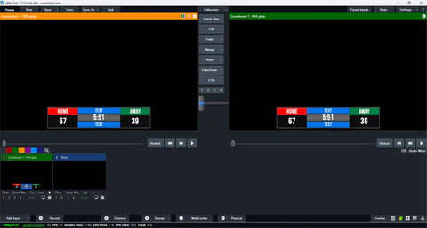
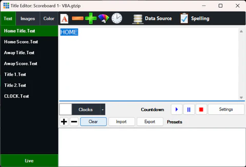
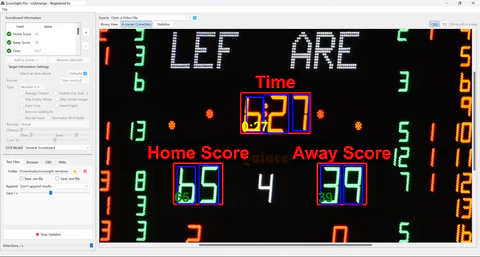
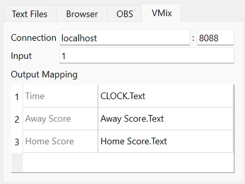
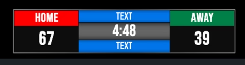

# vMix Integration

ScoreSight can interact directly with vMix through an API, providing a smooth and fast connection to vMix scoreboard Titles. Here is how to get it up and running.

First make sure vMix is accepting connections. This can be verified in the vMix Settings -> Web Controller screen. (Enable the TCP API option)

In a vMix input add a Title that fits your needs, for example this scoreboard (which is available in vMix):

Right click and open the Title Editor:

Note the names of the various texts in the Title, these would be controlled by ScoreSight.

In ScoreSight setup your scoreboard with detection boxes:

Go on the vMix tab and update or inspect the connection information like host and port (8099 is the vMix default), and choose the vMix Input according to your vMix setup. Next, set the mapping between ScoreSight detections and the vMix Title texts according to the information in the Title Editor (seen above).

Make sure the mappings are exactly as they appear in the Title Editor.

Once the mapping is complete the information will be updated on vMix automatically.

Consult the vMix guide on their API for reference: vMix User Guide

ScoreSight will be sending information using the SetText function.
